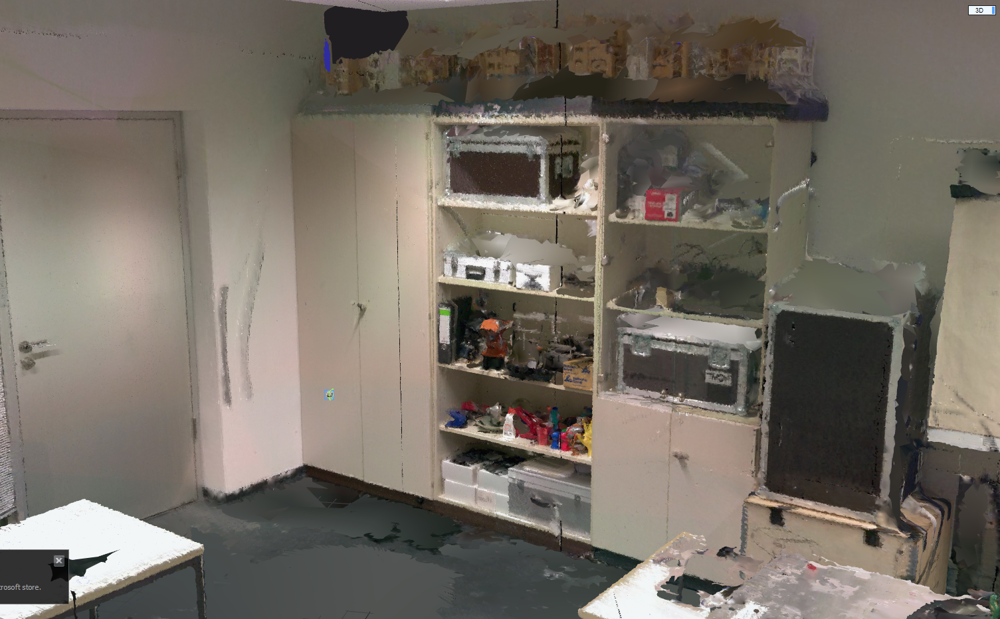

## weekly report: 28/02/2021
* Fit to low poly model
  * vr modeling with feature points clicked manually 
  * 
    
  * functionalities: add feature points, add faces by clicking points in some order 
* Features of a point cloud 
  * Learned the following features, and tried to compute them with the PCL library 
  * 

## weekly report: 21/02/2021
* Point Cloud Merging:
    * Merged building scale point cloud 
* Surface Reconstruction:
    * Tried the code from the paper: Instant Field-Aligned Meshes after reading the paper “The Replica Dataset: A Digital Replica of Indoor Spaces”
        * Does not support reading from point clouds originally, the algorithm supports
    * Found a fork that supports this, not working well as the following one 
    * Tried the code from the paper: Field-aligned online surface reconstruction
        * Works with small scene, takes too long time for large scene reconstruction 
        * Has a relative good mesh and visual effect, texture re-projection may be supported 
    * Worked for my thesis, a better GUI made
      *  
        
    * Selective LOD Rendering of my point clouds made, sub and super sampling  
        <!-- * WeChat Screenshot_20210220012830 -->
      * 
* Texture Reconstruction:
    * Familiar with the software: Reality Capture
        *  
           

        * Actually does not support texture re-projection, only supports from one model to an other, not what we need 
    * Prepare .e57 file with correct header, feed to RC
        * // Point cloud can not be loaded to RC after external edit, camera positions missing 
        * Tried to cure this issue with pye57 library, failed 
        * Tried to solve this problem with libe57Format, built successfully but the load of point clouds from sketch too complex, give up 
        * Tried to modify the source code of the software: CloudCompare, load camera positions from external file, success  
* Fit to low poly model:
    * Tried the project: PolyFit, only work with carefully segmented point clouds, which we do not have now, skip for now
    * 
      
    <!-- WeChat Screenshot_20210219000026 -->
    <!-- WeChat Screenshot_20210219110814 -->

* Literature Review
* Working hours: 10 

